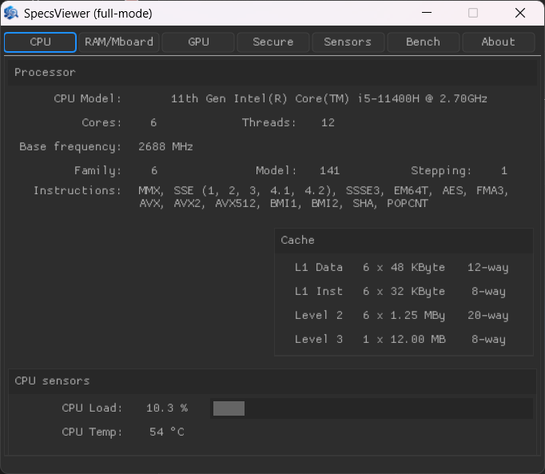
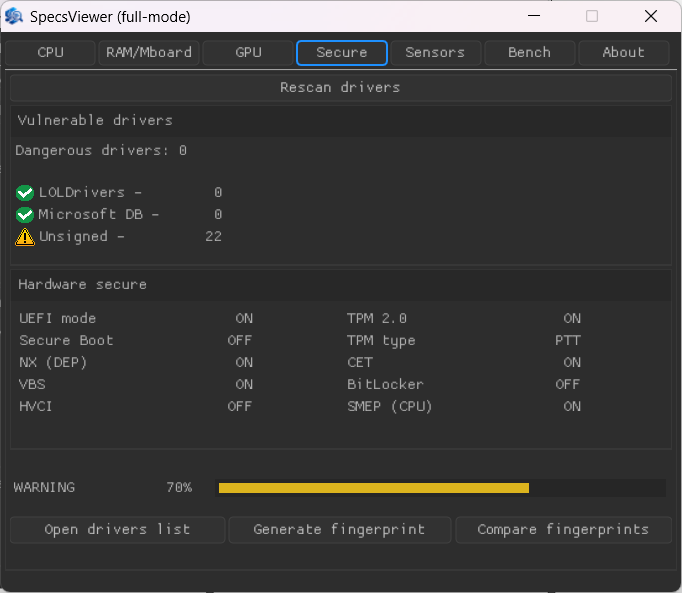
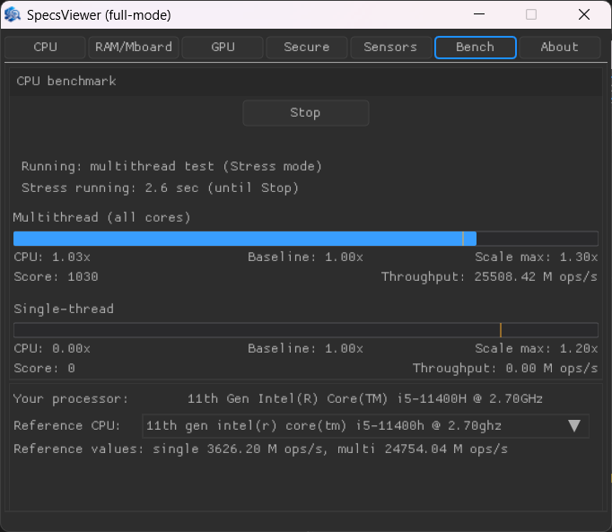

# SpecsViewer

**SpecsViewer** is a Windows desktop application for viewing detailed PC hardware information, checking platform security settings, running a basic benchmark, and generating a digital fingerprint of the system.

The program is focused not only on showing basic specifications, but also on analyzing low-level hardware and security-related data: CPU features, RAM, motherboard, GPU, BIOS/UEFI state, TPM, Secure Boot, drivers, benchmark results, and other platform characteristics.

SpecsViewer is written in **C** using the **C99** standard. The application uses **GLFW3** for window management, **Nuklear** for the graphical user interface, **GLAD** for OpenGL function loading, the **NVIDIA driver/API** for NVIDIA GPU information, and **WinRing0** for low-level hardware access.

> SpecsViewer uses **WinRing0** for low-level hardware access. It may cause antivirus warnings. I recommend adding the program folder to antivirus exclusions.

> It is also recommended to run SpecsViewer as Administrator for the most complete results. See the instruction below.

---

## Main Features

### Hardware overview

SpecsViewer collects and displays detailed information about the main PC components:

- CPU model and vendor
- CPU cores and threads
- CPU base frequency
- RAM information
- Motherboard information
- GPU information
- General system data

The goal is to provide a clear overview of the current platform without requiring the user to manually search for this information in different system tools.

---

### CPU information

The application analyzes processor data using low-level CPU instructions and system APIs.

It can show key CPU characteristics such as:

- CPU brand string
- Core and thread count
- Supported CPU features
- Architecture-related capabilities
- Basic frequency information

This makes the CPU section useful not only for normal specification viewing, but also for understanding what technologies are supported by the processor.

---

### RAM information

SpecsViewer provides information about installed system memory.

The RAM section is intended to quickly show the memory configuration of the machine and help identify the amount and basic characteristics of installed RAM.

---

### Motherboard and BIOS/UEFI information

The program collects platform-level information related to the motherboard, firmware, and system configuration.

This is important because many security mechanisms depend not only on the operating system, but also on firmware and motherboard configuration.

---

### GPU information

SpecsViewer includes GPU detection and displays information about the graphics adapter.

At the current stage, detailed GPU information is supported only for **NVIDIA** graphics cards.

This allows the application to include GPU data in the overall hardware overview, but support for AMD and Intel graphics cards may be added later.

---

### Platform security check

SpecsViewer checks important security-related mechanisms and configuration states.

The program can be used to review whether key platform protection features are enabled, disabled, or unavailable.

Examples of analyzed mechanisms:

- TPM state
- Secure Boot state
- BIOS/UEFI-related information
- Driver-related security checks
- General platform integrity indicators

The result is presented in a more understandable way than raw system data, making it easier to evaluate the current security state of the PC.

---

### Vulnerable driver detection

SpecsViewer includes driver-related checks to help identify potentially risky or vulnerable system components.

The application compares detected system drivers with known vulnerable driver databases, including:

- Microsoft vulnerable driver blocklist;
- LOLDrivers database.

This helps detect drivers that may be abused for privilege escalation, kernel access, bypassing security mechanisms, or other low-level attacks.

Drivers work at a very low level in Windows, so checking them is important for platform security analysis.

The result should be treated as an additional security indicator. If a vulnerable driver is detected, it is recommended to review its origin, update the related software, or remove the driver if it is not needed.

---

### Security / health score

The application calculates an overall platform score based on collected information.

This score is not meant to replace professional security auditing, but it gives the user a quick summary of the current system condition.

The score helps to quickly understand whether the system looks properly configured or if some important protection mechanisms may be missing or disabled.

---

### Benchmark

SpecsViewer includes a benchmark section for testing system performance.

The benchmark gives the user a quick way to estimate the current performance state of the machine and compare results after hardware, driver, or configuration changes.

The result can be useful for checking whether the system behaves normally after updates, BIOS changes, driver changes, or hardware replacement.

---

### Digital fingerprint

SpecsViewer can generate a digital fingerprint of the current PC configuration.

The fingerprint is based on selected hardware and platform characteristics. It can be used to detect changes in the system configuration between different launches of the program.

This feature is useful for:

- tracking hardware changes;
- detecting unexpected platform modifications;
- comparing the current state with a previous state;
- noticing possible unauthorized or suspicious changes.

If the fingerprint does not match a previously saved state, it does not always mean that the system is compromised. It means that some part of the hardware or platform configuration has changed and should be reviewed.

---

## Screenshots

### CPU information

### Security scan

### Benchmark

---

### Autoupdate

SpecsViewer also includes an auto-updater. It can check for newer versions of the program, download the latest release, and update the application files, helping users keep SpecsViewer up to date without manually replacing files.
